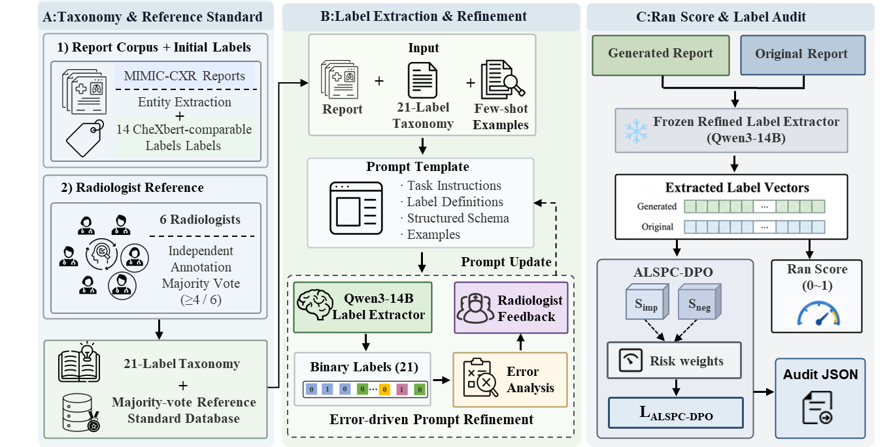
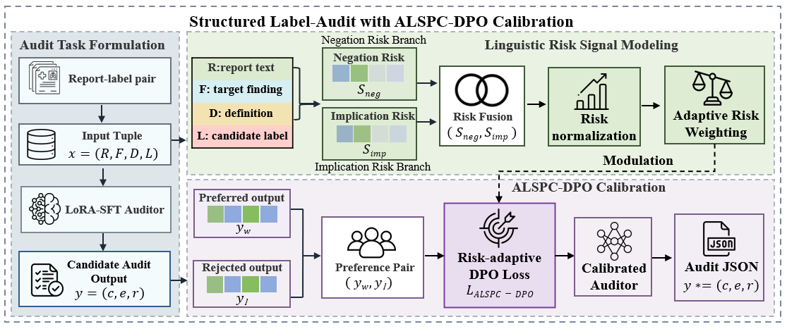

# Ran Score

[](https://doi.org/10.5281/zenodo.18489808)

Ran Score is a finding-level evaluation and neural audit framework for radiology report generation. The repository contains code for:

1. Qwen3-14B-based 21-label finding extraction and Ran Score computation.
2. Qwen3.5-9B supervised fine-tuning and ALSPC-DPO structured label auditing.
3. Biomedical and clinical encoder baselines for the structured label-audit task.

This repository intentionally excludes raw radiology reports, MIMIC-CXR images, local hospital data, model checkpoints, and generated training outputs.

## Framework



Fig. 1. Overall workflow of the Ran Score and ALSPC-DPO neural audit framework.



Fig. 2. Structured label-audit module with Adaptive Linguistic-Signal Preference Calibration DPO (ALSPC-DPO).

## Repository structure

```text
assets/
  ran_score_framework.png
  alspc_dpo_calibration.png
scripts/
  run_qwen_extractor.py          # Qwen3-14B finding extraction
  evaluate_ranscore_csv.py       # macro/micro finding-level metrics
  build_llamafactory_data.py     # SFT/DPO data construction
  build_alspc_margin_data.py     # adaptive margin construction
  patch_llamafactory_alspc.py    # LLaMA-Factory ALSPC patch helper
  validate_llamafactory_data.py  # data validation
  evaluate_prediction_metrics.py # structured audit metrics
  analyze_prediction_errors.py   # audit error analysis
  check_dataset_leakage.py       # split leakage checks
  generate_qwen_rationales.py    # optional rationale generation
  audit_qwen_rationales.py       # rationale coverage audit
  train_hf_audit_classifier.py   # encoder baseline training
configs/llamafactory/
  sft.yaml
  alspc_dpo.yaml
  alspc_dpo_predict_test.yaml
docs/
  ran_score_extraction.md
  alspc_dpo.md
  encoder_baselines.md
  data_release.md
examples/
  sample_reports.csv
  sample_qwen_labels.csv
  sample_audit_dataset.csv
  sample_generated_predictions.jsonl
```

## Installation

```bash
conda create -n ranscore python=3.10 -y
conda activate ranscore
pip install -r requirements.txt
```

For Qwen3.5-9B SFT/ALSPC-DPO experiments, install LLaMA-Factory separately and follow its environment instructions.
Before training, replace `${QWEN35_MODEL_PATH}` in `configs/llamafactory/*.yaml` with the local Qwen3.5-9B checkpoint path.

## 1. Run Qwen3-14B finding extraction

Serve Qwen3-14B with an OpenAI-compatible endpoint such as vLLM, then run:

```bash
python scripts/run_qwen_extractor.py   --input examples/sample_reports.csv   --report-column report   --id-columns study_id   --output outputs/sample_qwen_labels.csv   --base-url http://localhost:8000/v1   --model Qwen/Qwen3-14B
```

## 2. Compute Ran Score metrics

```bash
python scripts/evaluate_ranscore_csv.py   --gold examples/sample_qwen_labels.csv   --pred examples/sample_qwen_labels.csv   --output-dir outputs/sample_ranscore_metrics
```

## 3. Train the structured ALSPC-DPO auditor

Prepare the structured audit data following `docs/data_release.md`. A small toy dataset is included only for smoke testing the data pipeline:

```bash
python scripts/build_llamafactory_data.py   --input examples/sample_audit_dataset.csv   --output-dir data/llamafactory_ranaudit   --fallback template
python scripts/validate_llamafactory_data.py   --data-dir data/llamafactory_ranaudit
python scripts/build_alspc_margin_data.py   --input-dir data/llamafactory_ranaudit   --output-dir data/llamafactory_ranaudit_alspc   --mode alspc   --m0 0.1202   --alpha-neg 1.1497   --alpha-imp 0.3247   --m-max 0.7819
```

Before ALSPC-DPO training, apply the LLaMA-Factory patch in the same environment that runs `llamafactory-cli`:

```bash
python scripts/patch_llamafactory_alspc.py --dry-run
python scripts/patch_llamafactory_alspc.py
```

For the manuscript-scale experiments, replace the toy data with the full structured audit dataset, then train and evaluate:

```bash
llamafactory-cli train configs/llamafactory/sft.yaml
llamafactory-cli train configs/llamafactory/alspc_dpo.yaml
llamafactory-cli train configs/llamafactory/alspc_dpo_predict_test.yaml
python scripts/evaluate_prediction_metrics.py   --pred-path outputs/predictions/qwen35_9b_lora_alspc_dpo_test/generated_predictions.jsonl
```

## 4. Train encoder baselines

```bash
python scripts/train_hf_audit_classifier.py   --model-name-or-path /path/to/model   --data-dir data/bert_label_audit   --output-dir outputs/encoder_baselines/model_name   --max-length 512   --learning-rate 2e-5   --num-train-epochs 5   --per-device-train-batch-size 8   --per-device-eval-batch-size 16   --warmup-ratio 0.1   --weight-decay 0.01   --seed 42
```

## Data availability and restrictions

Raw MIMIC-CXR reports/images and local hospital reports are not redistributed here. Publicly shareable derived annotations and metadata should be downloaded from the accompanying data release, subject to the dataset licenses and data-use agreements described in `docs/data_release.md`.

## Citation

Please cite the accompanying manuscript if you use this code.
